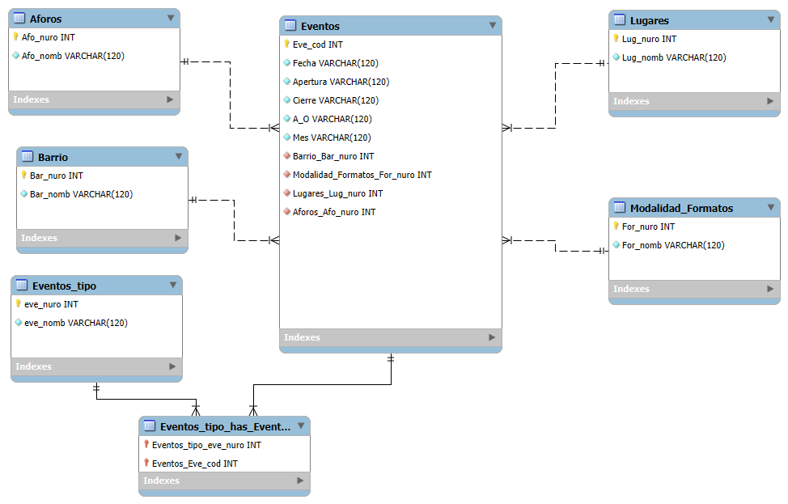

|  | <p align="left"> Base de datos y Gestión de proyecto de software.  <br> TF Base de datos libre. </p>  |
| --------------------------------------- |--------------------------------------------------------------------------------- |


<br>
<p align="center">
  <BR>
   <BR>
  <BR>
  <BR>
  <br>
  <BR> Trabajo Final de Base de Datos Libre <BR>
          Elian Cairati ,María Juliana Pintos <BR>
  Técnico Superior en Desarrollo de Software, Escuela Superior de Comercio N° 43<BR>
          3° Base de Datos<BR>
        3° Gestión y Proyectos de Software<BR>
          Ariel Nardelli<BR>
          Matias Nardelli<BR>
        03 de septiembre 2024<BR>
</p> <BR>

<table width="9000%", align="center",long="9000%">
  <tr>
    <td>
       <p align="center",> Elian Cairati, María Juliana Pintos</p>
       <p align="center" >3° Año - Técnico Superior en Desarrollo de Software</p> 
       <p align="center">Escuela Superior de comercio N°43</p>
    </td>
  </tr>
</table>

## Índice

1. [Trabajo final](#trabajo-final)
2. [Introducción](#introducción)
3. [Importar un archivo excel a heidi](#importar-un-archivo-excel-a-heidi)
4. [Crear una nueva tabla y exportar la información de forma ordenada](#crear-una-nueva-tabla-y-exportar-la-información-de-forma-ordenada)
5. [La base de datos original](#la-base-de-datos-original)
6. [Utilizamos los siguientes comandos para reemplazar la base de datos](#utilizamos-los-siguientes-comandos-para-reemplazar-la-base-de-datos)
7. [La base de datos reemplazada](#la-base-de-datos-reemplazada)
8. [Diagrama de entidad-relación (DER)](#diagrama-de-entidad-relación-(DER))
9. [Consultas](#consultas)
10. [Conclusión](#conclusión)
11. [Bibliografía](#bibliografía)


# Trabajo final
<p alingn="justify">Presentar la base de datos elegida al profesor y realizar un análisis de los archivos excel o del formato que esté la información y en base a eso diseñar una base de datos con sus tablas que contenga dicha información. Diseñar también indices alternativos y las relaciones entre las mismas. <br>Presentar el diseño de las tablas gráficamente mediante el software que usted desee.</p>
<p><b>Lenguaje SQL</b>
<li>Sentencias DDL (Lenguaje de definición de datos) de creación de tablas y relaciones.</li>
<li>Importar los datos desde los archivos excel y llenar las tablas creadas con dicha información.</li></p>
<p>El trabajo debe ser alojado en un repositorio publico en el cual deben estar el archivo de datos publicos utilizado en formato “csv”, un archivo de respaldo de la base de datos una vez finalizada y confeccionar un archivo Readme.md donde describan la base de datos, contener diagrama, y demostración de las sentencias solicitadas anteriormente. Además, crear instrucciones de como importar el archivo de respaldo para ser utilizado por otras personas.</p>

# Introducción
<p aling="justify">En el contexto de elegir una base de datos, el profesor nos proporcionó páginas con bases de datos libres donde podemos buscar la que más nos llame la atención y, al mismo tiempo, cumpla con los requisitos solicitados para el trabajo. En nuestro caso, la base de datos seleccionada gestionará los permisos para eventos masivos del 2024, dado que contiene información sobre los eventos, las localizaciones y las regulaciones implicadas. Se requiere una solución eficiente que permita manejar la información de manera precisa y segura.</p>


# Importar un archivo excel a heidi

Para poder importar una tabla de excel a heidi, demos abrir en heidi y crear una base de datos, una vez que esta creada en la barra de herramientas nos pareca como (importar archivo csv).

<p align="center">
  
</p>


* Creamos una nueva tabla y colocamos todas las columnas en VARCHAR.
* Determinamos los campos de la forma que es el programa(si es por , o “”).
* En manejo de filas duplicadas colocamos INSERT(puede provocar errores)).
* Ponemos la decodificación en utf8: UTF-8 unicode.

  <div style="display: flex; justify-content: center;">
    
    
  </div>

# Crear una nueva tabla y exportar la información de forma ordenada
* TABLA 1
<table>
  <tr>
    <td colspan="2">
      <table>
        <tr>
          <p align="center">LUGARES</p>
        </tr>
      </table>
    </td>
  </tr>
  <tr>
    <td>
      <table>
        <tr>
           
        </tr>
      </table>
    </td>
    <td>
      <table>
        <tr>
           <p align="left"><li> CREATE TABLE lugares(</li> </p> <p align="left"><li> lug_nuro INT AUTO_INCREMENT NOT NULL PRIMARY KEY,</li></p><p align="left"><li>lug_nomb VARCHAR(120) );</li></p><p align="left">Despues para poder exportar la información de la tabla eventos a lugares decidimos utilizar este comando:></p><p align="left"><li>INSERT INTO lugares (lug_nomb) SELECT distinct(lugar) FROM eventos;</li> </p> 
        </tr>
      </table>
    </td>
  </tr>
</table>
<li>TABLA 2 </li>
<table>
  <tr>
    <td colspan="2">
      <table>
        <tr>
          <p align="center">AFORO</p>
        </tr>
      </table>
    </td>
  </tr>
  <tr>
    <td>
      <table>
        <tr>
           
        </tr>
      </table>
    </td>
    <td>
      <table>
        <tr>
           <p align="left"><li> CREATE TABLE aforo(</li> </p> <p align="left"><li> afo_nuro INT AUTO_INCREMENT NOT NULL PRIMARY KEY,</li></p><p align="left"><li>afo_nomb VARCHAR(120));</li></p><p align="left"><li>INSERT INTO aforo (afo_nomb) SELECT distinct(aforo) FROM eventos;</li> </p> 
        </tr>
      </table>
    </td>
  </tr>
</table>
<li>TABLA 3 </li>
<table>
  <tr>
    <td colspan="2">
      <table>
        <tr>
          <p align="center">BARRIOS</p>
        </tr>
      </table>
    </td>
  </tr>
  <tr>
    <td>
      <table>
        <tr>
           
        </tr>
      </table>
    </td>
    <td>
      <table>
        <tr>
           <p align="left"><li> CREATE TABLE Barrios(</li> </p> <p align="left"><li> bar_nuro INT AUTO_INCREMENT NOT NULL PRIMARY KEY,</li></p><p align="left"><li>bar_nomb VARCHAR(120) );</li></p><p align="left"><li>INSERT INTO barrios (bar_nomb) SELECT distinct(barrio) FROM eventos;</li> </p> 
        </tr>
      </table>
    </td>
  </tr>
</table>
<li>TABLA 4 </li>
<table>
  <tr>
    <td colspan="2">
      <table>
        <tr>
          <p align="center">EVENTOS_TIPO</p>
        </tr>
      </table>
    </td>
  </tr>
  <tr>
    <td>
      <table>
        <tr>
           
        </tr>
      </table>
    </td>
    <td>
      <table>
        <tr>
           <p align="left"><li> CREATE TABLE eventos_tipo(</li> </p> <p align="left"><li> eve_nuro INT AUTO_INCREMENT NOT NULL PRIMARY KEY,</li></p><p align="left"><li>eve_nomb VARCHAR(120) );</li></p><p align="left"><li>INSERT INTO eventos_tipo (eve_nomb) SELECT distinct(evento) FROM eventos;</li> </p> 
        </tr>
      </table>
    </td>
  </tr>
</table>
<li>TABLA 5 </li>
<table>
  <tr>
    <td colspan="2">
      <table>
        <tr>
          <p align="center">MODALIDAD_FORMATO</p>
        </tr>
      </table>
    </td>
  </tr>
  <tr>
    <td>
      <table>
        <tr>
           
        </tr>
      </table>
    </td>
    <td>
      <table>
        <tr>
           <p align="left"><li> CREATE TABLE modalidad_formatos(</li> </p> <p align="left"><li> for_nuro INT AUTO_INCREMENT NOT NULL PRIMARY KEY,</li></p><p align="left"><li>for_nomb VARCHAR(120) );</li></p><p align="left"><li>INSERT INTO modalidad_formatos (for_nomb) SELECT distinct(modalidad_formato) FROM eventos;</li> </p> 
        </tr>
      </table>
    </td>
  </tr>
</table>

# La base de datos original 
 


# Utilizamos los siguientes comandos para reemplazar la base de datos
* Esta consulta actualiza la información de la tabla principal de eventos. En estos casos actualizaremos las columnas de "lugar","barrio","modalidad_formato","aforo" y "eventos" de la tabla eventos que contiene sus nombres, estos serán reemplazados por el ID de de cada campos.
```sql
UPDATE eventos
JOIN lugares ON eventos.lugar = lugares.lug_nomb
SET eventos.lugar = lugares.lug_nuro
WHERE eventos.lugar = lugares.lug_nomb;
```
```sql
UPDATE eventos
JOIN barrios ON eventos.BARRIO = barrios.bar_nomb
SET eventos.BARRIO = barrios.bar_nuro
WHERE eventos.BARRIO = barrios.bar_nomb
```
```sql
UPDATE eventos
JOIN modalidad_formatos ON eventos.MODALIDAD_FORMATO = modalidad_formatos.for_nomb
SET eventos.MODALIDAD_FORMATO = modalidad_formatos.for_nuro
WHERE eventos.MODALIDAD_FORMATO = modalidad_formatos.for_nomb;
```
```sql
UPDATE eventos
JOIN aforos ON eventos.AFORO = aforos.afo_nomb
SET eventos.AFORO = aforos.afo_nuro
WHERE eventos.AFORO = aforos.afo_nomb;
```
```sql
UPDATE eventos
JOIN eventos_tipo ON eventos.EVENTO = eventos_tipo.eve_nomb
SET eventos.EVENTO = eventos_tipo.eve_nuro
WHERE eventos.EVENTO = eventos_tipo.eve_nomb;
```

# La base de datos reemplazada
 

# Diagrama de entidad-relación (DER)
<p>Para finalizar el trabaja hicimos un diagrama de clases mostrando las relaciones que tienen dichas tablas: </p><br>
<div style="display: flex; justify-content: center;">
    
  </div>


# Consultas
<p align="justify">Aca dejamos algunas consultas que hicimos a la base de datos:</p><br>

* Selecciona los eventos cuando el formato sea recital o concierto que ocurren en el barrio de palermo

```sql

SELECT eventos.fecha as horario,eventos_tipo.eve_nomb,
modalidad_formatos.for_nomb as formato, barrios.bar_nomb from eventos

JOIN eventos_tipo ON eventos.evento = eventos_tipo.eve_nuro
JOIN modalidad_formatos ON eventos.MODALIDAD_FORMATO = modalidad_formatos.for_nuro
JOIN barrios ON eventos.BARRIO = barrios.bar_nuro

where (modalidad_formatos.for_nomb = "Recital" or modalidad_formatos.for_nomb = "Paseo") AND 
barrios.bar_nomb = "Palermo";
```
* Cuenta todos los eventos cuando el aforo es 990

```sql
SELECT  eventos.FECHA AS horario,modalidad_formatos.for_nomb , aforos.afo_nomb,
barrios.bar_nomb, COUNT(*) as evento FROM eventos

JOIN modalidad_formatos ON eventos.MODALIDAD_FORMATO = modalidad_formatos.for_nuro
JOIN barrios ON eventos.BARRIO = barrios.bar_nuro
JOIN aforos ON eventos.AFORO = aforos.afo_nuro

WHERE aforos.afo_nomb = "990";
```
* Selecciona los eventos que se realzan en el barrio palermo pero no cuando el formato es recital o concierto

```sql
SELECT eventos.fecha as horario,eventos_tipo.eve_nomb,
modalidad_formatos.for_nomb as formato, barrios.bar_nomb from eventos

JOIN eventos_tipo ON eventos.evento = eventos_tipo.eve_nuro
JOIN modalidad_formatos ON eventos.MODALIDAD_FORMATO = modalidad_formatos.for_nuro
JOIN barrios ON eventos.BARRIO = barrios.bar_nuro

where NOT (modalidad_formatos.for_nomb = "Recital" or modalidad_formatos.for_nomb = "Paseo") and
barrios.bar_nomb = "Palermo";
```
* Selecciona los 10 primeros eventos cuando el aforo es igual a 990

```sql
SELECT eventos.FECHA AS horario, eventos_tipo.eve_nomb, lugares.lug_nomb, modalidad_formatos.for_nomb as formato,
eventos.APERTURA, eventos.CIERRE,aforos.afo_nomb, barrios.bar_nomb from eventos

JOIN barrios ON eventos.BARRIO = barrios.bar_nuro
JOIN aforos ON eventos.AFORO = aforos.afo_nuro
JOIN lugares ON eventos.LUGAR = lugares.lug_nuro
JOIN eventos_tipo ON eventos.EVENTO = eventos_tipo.eve_nuro 
JOIN modalidad_formatos ON eventos.MODALIDAD_FORMATO = modalidad_formatos.for_nuro

WHERE aforos.afo_nomb = "990" LIMIT 0,10;
```
* Ignora los primeros 10 eventos y selecciona los siguientes 10 eventos cuando el formato es recital

```sql
SELECT eventos.FECHA AS horario, eventos_tipo.eve_nomb, lugares.lug_nomb, modalidad_formatos.for_nomb as formato,
eventos.APERTURA, eventos.CIERRE,aforos.afo_nomb, barrios.bar_nomb from eventos

JOIN barrios ON eventos.BARRIO = barrios.bar_nuro
JOIN aforos ON eventos.AFORO = aforos.afo_nuro
JOIN lugares ON eventos.LUGAR = lugares.lug_nuro
JOIN eventos_tipo ON eventos.EVENTO = eventos_tipo.eve_nuro
JOIN modalidad_formatos ON eventos.MODALIDAD_FORMATO = modalidad_formatos.for_nuro

WHERE modalidad_formatos.for_nomb = "Recital" LIMIT 10,10;
```
* Muestra los eventos cuando el aforos es igual a 1000 o 5000, el formato es carrera o jornada, ordena los formatos de manera decendiente y los aforos acendiente
```sql
SELECT eventos.FECHA AS horario,modalidad_formatos.for_nomb as formato, aforos.afo_nomb,
barrios.bar_nomb from eventos

JOIN modalidad_formatos ON eventos.MODALIDAD_FORMATO = modalidad_formatos.for_nuro
JOIN barrios ON eventos.BARRIO = barrios.bar_nuro
JOIN aforos ON eventos.AFORO = aforos.afo_nuro

where (aforos.afo_nomb = "1000" or aforos.afo_nomb = "5000") OR 
(modalidad_formatos.for_nomb = "carrera" or modalidad_formatos.for_nomb = "jornada")
ORDER BY modalidad_formatos.for_nomb desc , aforos.afo_nomb ASC;

```

# Conclusión 
<p>En conclusión, durante el trabajo enfrentamos dificultades al seleccionar una base de datos, utilizar las aplicaciones GitHub, HeidiSQL y XAMPP, y también al elaborar las consultas. Sin embargo, gracias al trabajo en equipo, pudimos superar estos obstáculos y logramos terminar el proyecto a tiempo.</p>

# Bibliografía

* La página de donde sacamos la base de datos:
  
http://data.buenosaires.gob.ar


