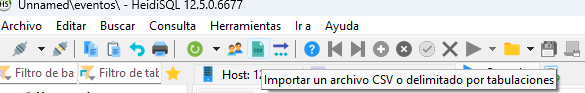
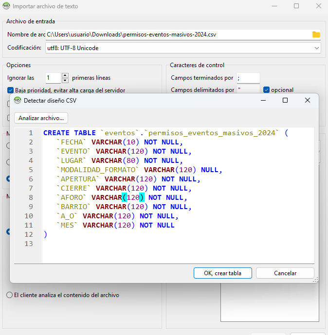
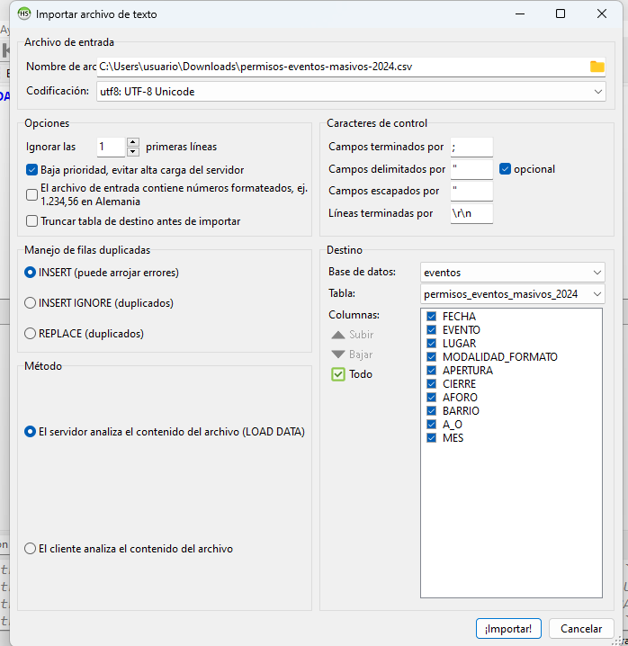
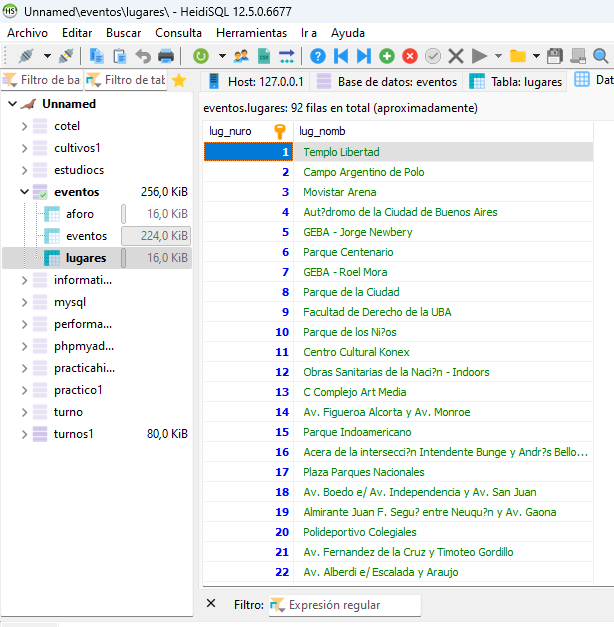
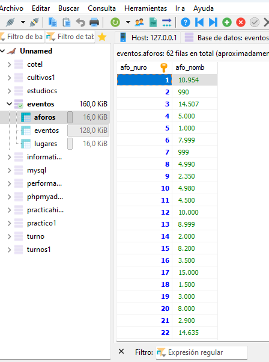
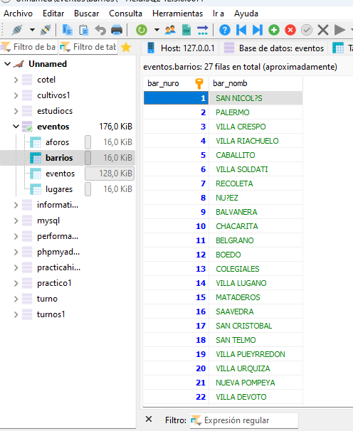
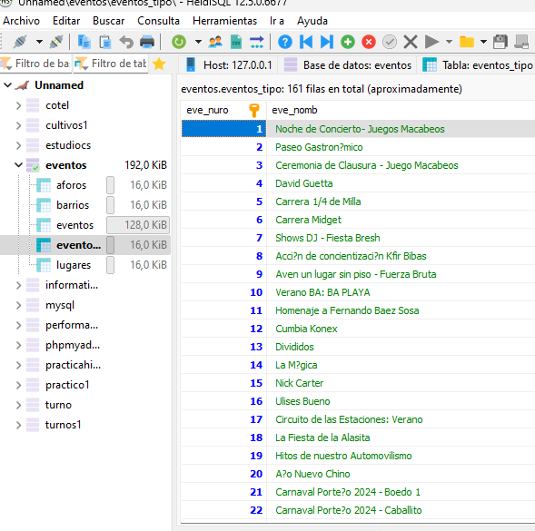
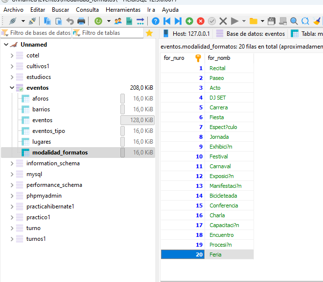
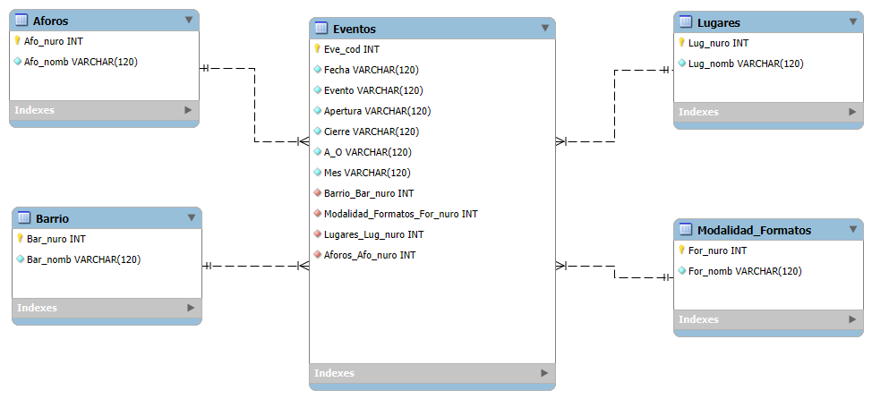

|  | 
 Base de datos y Gestión de proyecto de software.    TF Base de datos libre. 
  |
| --------------------------------------- |--------------------------------------------------------------------------------- |

 

   
    
   
   
   
    Trabajo Final de Base de Datos Libre  
          Elian Cairati ,María Juliana Pintos  
  Técnico Superior en Desarrollo de Software, Escuela Superior de Comercio N° 43 
          3° Base de Datos 
        3° Gestión y Proyectos de Software 
          Ariel Nardelli 
          Matias Nardelli 
        03 de septiembre 2024 

  

<table width="9000%", align="center",long="9000%">
  <tr>
    <td>
       
 Elian Carati, María Juliana Pintos

       
3° Año - Técnico Superior en Desarrollo de Software
 
       
Escuela Superior de comercio N°43

    </td>
  </tr>
</table>

# Trabajo-final

Presentar la base de datos elegida al profesor y realizar un análisis de los archivos excel o del formato que esté la información y en base a eso diseñar una base de datos con sus tablas que contenga dicha información. Diseñar también indices alternativos y las relaciones entre las mismas.  Presentar el diseño de las tablas gráficamente mediante el software que usted desee.

<b>Lenguaje SQL</b>
<li>Sentencias DDL (Lenguaje de definición de datos) de creación de tablas y relaciones.</li>
<li>Importar los datos desde los archivos excel y llenar las tablas creadas con dicha información.</li>

El trabajo debe ser alojado en un repositorio publico en el cual deben estar el archivo de datos publicos utilizado en formato “csv”, un archivo de respaldo de la base de datos una vez finalizada y confeccionar un archivo Readme.md donde describan la base de datos, contener diagrama, y demostración de las sentencias solicitadas anteriormente. Además, crear instrucciones de como importar el archivo de respaldo para ser utilizado por otras personas.

# Introducción

En el contexto de eleguir una base de datos, el profesor nos aporto en el trabajo las páginas donde encontraremos base de datos libre en donde buscamos la que más nos llame la atención y también que cumplan los requisitos que nos pedian en el trabajo. En nuestro caso, la elección de base de datos, está gestiona los permisos de eventos masivos del 2024, dado que nos aporta datos de los eventos, las localizaciones y regulaciones implicadas, se requiere una solución eficiente que permita manejar la información de manera precisa y segura.

# Importar un archivo excel a heidi

Para poder importar una tabla de excel a heidi, demos abrir en heidi y crear una base de datos, una vez que esta creada en la barra de herramientas nos pareca como (importar archivo csv).

  

* Creamos una nueva tabla y colocamos todas las columnas en VARCHAR.
* Determinamos los campos de la forma que es el programa(si es por , o “”).
* En manejo de filas duplicadas colocamos INSERT(puede provocar errores)).
* Ponemos la decodificación en utf8: UTF-8 unicode.

  

    
    
  

# Crear una nueva tabla y exportar la información de forma ordenada
* TABLA 1
<table>
  <tr>
    <td colspan="2">
      <table>
        <tr>
          
LUGARES

        </tr>
      </table>
    </td>
  </tr>
  <tr>
    <td>
      <table>
        <tr>
           
        </tr>
      </table>
    </td>
    <td>
      <table>
        <tr>
           
<li> CREATE TABLE lugares(</li> 
 
<li> lug_nuro INT AUTO_INCREMENT NOT NULL PRIMARY KEY,</li>

<li>lug_nomb VARCHAR(120) );</li>

Despues para poder exportar la información de la tabla eventos a lugares decidimos utilizar este comando:>

<li>INSERT INTO lugares (lug_nomb) SELECT distinct(lugar) FROM eventos;</li> 
 
        </tr>
      </table>
    </td>
  </tr>
</table>
* TABLA 2
<table>
  <tr>
    <td colspan="2">
      <table>
        <tr>
          
AFORO

        </tr>
      </table>
    </td>
  </tr>
  <tr>
    <td>
      <table>
        <tr>
           
        </tr>
      </table>
    </td>
    <td>
      <table>
        <tr>
           
<li> CREATE TABLE aforo(</li> 
 
<li> afo_nuro INT AUTO_INCREMENT NOT NULL PRIMARY KEY,</li>

<li>afo_nomb VARCHAR(120));</li>

<li>INSERT INTO aforo (afo_nomb) SELECT distinct(aforo) FROM eventos;</li> 
 
        </tr>
      </table>
    </td>
  </tr>
</table>
* TABLA 3
<table>
  <tr>
    <td colspan="2">
      <table>
        <tr>
          
BARRIOS

        </tr>
      </table>
    </td>
  </tr>
  <tr>
    <td>
      <table>
        <tr>
           
        </tr>
      </table>
    </td>
    <td>
      <table>
        <tr>
           
<li> CREATE TABLE Barrios(</li> 
 
<li> bar_nuro INT AUTO_INCREMENT NOT NULL PRIMARY KEY,</li>

<li>bar_nomb VARCHAR(120) );</li>

<li>INSERT INTO barrios (bar_nomb) SELECT distinct(barrio) FROM eventos;</li> 
 
        </tr>
      </table>
    </td>
  </tr>
</table>
* TABLA 4
<table>
  <tr>
    <td colspan="2">
      <table>
        <tr>
          
EVENTOS_TIPO

        </tr>
      </table>
    </td>
  </tr>
  <tr>
    <td>
      <table>
        <tr>
           
        </tr>
      </table>
    </td>
    <td>
      <table>
        <tr>
           
<li> CREATE TABLE eventos_tipo(</li> 
 
<li> eve_nuro INT AUTO_INCREMENT NOT NULL PRIMARY KEY,</li>

<li>eve_nomb VARCHAR(120) );</li>

<li>INSERT INTO eventos_tipo (eve_nomb) SELECT distinct(evento) FROM eventos;</li> 
 
        </tr>
      </table>
    </td>
  </tr>
</table>
* TABLA 5
<table>
  <tr>
    <td colspan="2">
      <table>
        <tr>
          
MODALIDAD_FORMATO

        </tr>
      </table>
    </td>
  </tr>
  <tr>
    <td>
      <table>
        <tr>
           
        </tr>
      </table>
    </td>
    <td>
      <table>
        <tr>
           
<li> CREATE TABLE modalidad_formatos(</li> 
 
<li> for_nuro INT AUTO_INCREMENT NOT NULL PRIMARY KEY,</li>

<li>for_nomb VARCHAR(120) );</li>

<li>INSERT INTO modalidad_formatos (for_nomb) SELECT distinct() FROM eventos;</li> 
 
        </tr>
      </table>
    </td>
  </tr>
</table>

# Consultas
* SELECT * FROM eventos WHERE aforo= "990";
* SELECT * FROM eventos WHERE aforo= "990" AND modalidad_formato = "paseo"
* SELECT * FROM eventos WHERE aforo= "990" or modalidad_formato = "paseo";
* SELECT * FROM eventos WHERE ((aforo = "990") or (aforo = "1.000"));
* SELECT * FROM eventos GROUP BY modalidad_formato ORDER BY fecha ;

# Sistema de Base de Datos

    
  

